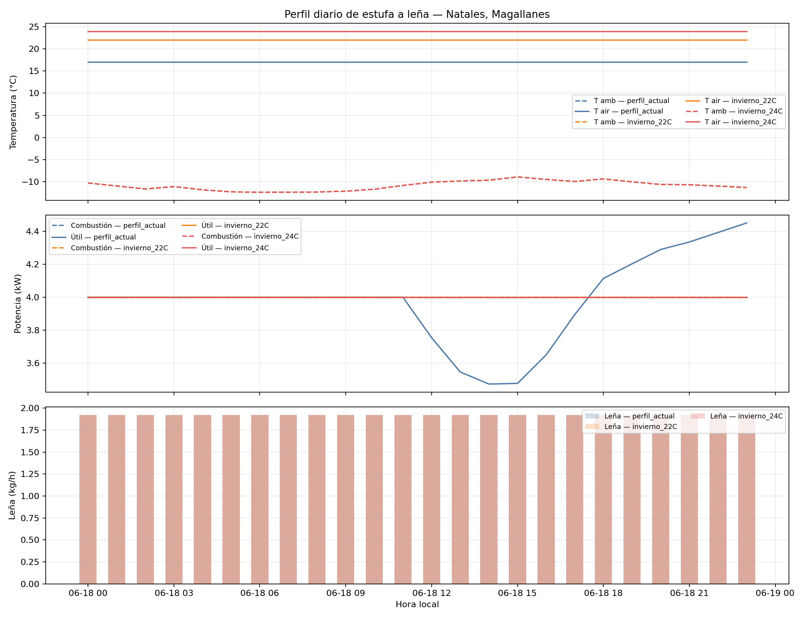

# Perfil diario de estufa a leña en invierno

- Inmueble: `2577343`.
- Comuna: `Natales`; región: `Magallanes`.
- Arquetipo: `CL.SFH.preRT.mad.I`; zona térmica: `I`.
- Día seleccionado: `2024-06-18`; criterio: día invernal con menor temperatura media diaria.
- El año completo se simuló antes de extraer el día para conservar el objetivo anual REDPE y el estado de almacenamiento.

## Parámetros de la estufa

- `event_fuel_energy_kwh`: `16.0`.
- `event_duration_hours`: `2.0`.
- `min_event_interval_hours`: `1.0`.
- `storage_capacity_kwh`: `16.0`.
- `storage_loss_rate_per_hour`: `0.0`.

## Resumen diario

| Escenario | T. ambiente media (°C) | T. aire min–max (°C) | Demanda (kWh) | Combustión (kWh) | Calor útil (kWh) | Leña (kg) | Eventos |
|---|---:|---:|---:|---:|---:|---:|---:|
| perfil_actual | -10.9 | 17.0–17.0 | 101.5 | 96.0 | 95.6 | 46.08 | 12 |
| invierno_22C | -10.9 | 22.0–22.0 | 121.4 | 96.0 | 96.0 | 46.08 | 12 |
| invierno_24C | -10.9 | 24.0–24.0 | 129.4 | 96.0 | 96.0 | 46.08 | 12 |

`stove_combustion_power_kw` es la potencia térmica producida por la
combustión después de la eficiencia; `stove_useful_power_kw` es la
potencia efectivamente entregada a la demanda 5R1C; y
`wood_consumed_kg` es la masa química consumida en cada hora usando
PCI = 15 MJ/kg.

Los perfiles horarios completos están en
`winter_day_hourly_profile.csv`.

